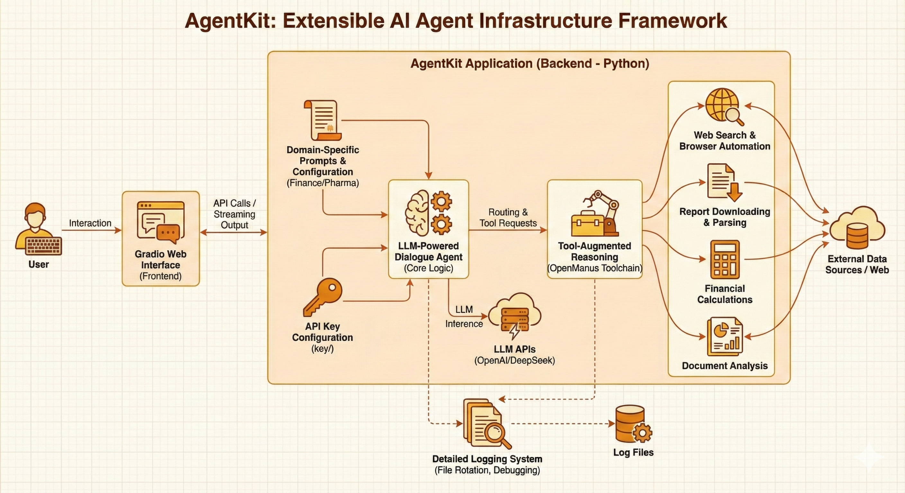

# AgentKit

**AgentKit** is an extensible AI Agent infrastructure framework designed for developers to rapidly build, customize, and deploy tool-augmented agents. It includes example functionalities focused on **financial** and **pharmaceutical** domains to demonstrate real-world applications.



---

## Version

- Latest **V0.11**: Update front end and prompt backend.

---

## 📁 Project Structure

```
AgentKit/
│
├── app/            # Main entry point with Gradio-based frontend interface
│
├── key/            # API key configuration for LLM (e.g., OpenAI or DeepSeek)
│
└── open_manus/     # The OpenManus toolchain used for agent operations
```

---

## Features

- **LLM-Powered Dialogue Agent**  
  Built on top of large language models (LLMs) such as [DeepSeek](https://www.deepseek.com/) or OpenAI GPT. Supports multi-turn conversations and instruction following.

- **Tool-Augmented Reasoning**  
  Automatically detects when a tool is needed and routes the request to the `OpenManus` toolchain. Tools include:
  - Web search & browser automation
  - Report downloading & parsing
  - Financial calculations & document analysis

- **Web Interface with Gradio**  
  Clean UI for chat interaction. Includes real-time streaming output and tool execution status updates.

- **Finance & Pharma Use Cases**  
  Example prompts and system behavior customized for financial analysts and pharma researchers.

- **Detailed Logging**  
  Rich log system with file rotation, separated logs for LLM and tools, and real-time debugging support.

---

## 🚀 Quick Start

**1. Clone the Repository**

```bash
git clone https://github.com/yourname/AgentKit.git
cd AgentKit
```

**2. Install Requirements**

Recommend using conda to manage pip packages.

```bash
pip install -r requirements.txt
cd open_manus
pip install -r requirements.txt
```

**3. Configure Your API Keys**

Create or modify the file `key/key.py` with your API credentials:

```python
MAIN_APP_KEY = "your-openai-or-deepseek-api-key"
MAIN_APP_URL = "https://api.deepseek.com/v1"  # or OpenAI base URL
```

Also modify the file `key/manus_config/config.toml`

**4. Run the Application**

```bash
python3 -m app
```

Recommend using vscode to run, vscode can guide you open the browser, also you can visit [http://localhost:7860](http://localhost:7860) in your browser.

---

